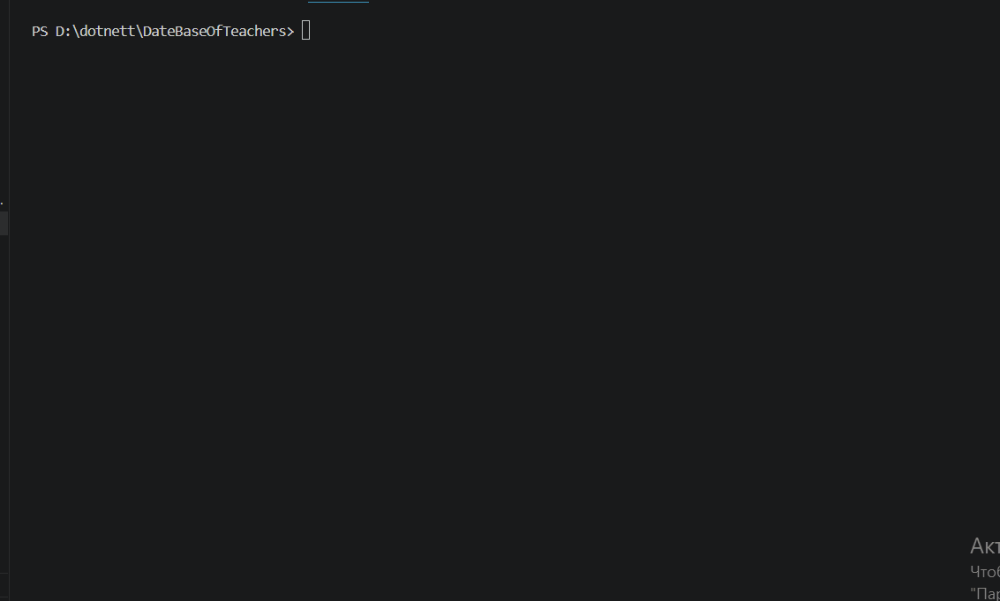

# DateBaseOfTeachers
# 📚 Database Of Teachers

A simple C# Console Application for managing teacher information using OOP principles.

## Features

- Add New Teacher
- Show Teacher Database
- Auto Increment Teacher ID
- Array-Based Storage
- Interface & Service Architecture

## Technologies

- C#
- .NET
- OOP
- Interfaces
- Arrays

## Project Structure

```text
Models/
 └─ Teacher.cs

Services/
 ├─ ITeacherService.cs
 └─ TeacherService.cs

Program.cs
```

## Teacher Information

- Id
- Full Name
- Subject
- Experience
- Address

## Run



## Author

**Tursunboy Ergashev**
